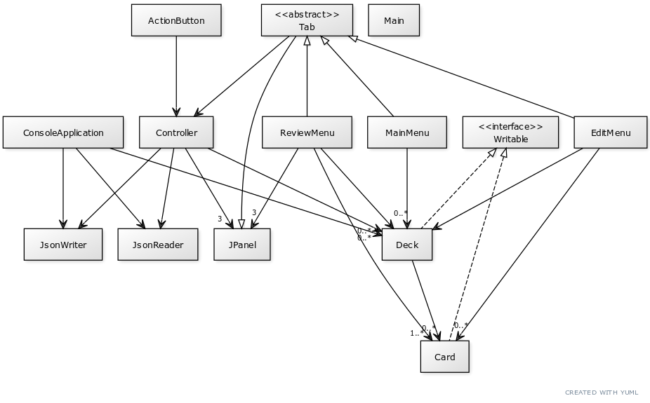

# Reviewer

Reviewer is an application which allows users to create their own digital flashcard decks to retain information or
learn new knowledge! Users' are able to create cards with different contents in the front/back of the card
with information, just like a flashcard in real life. Users are also able to then edit their decks by remaining their
decks and adding/removing cards from their decks! 

Users can then review their flashcards using the review option. For each review complete, the mastery level of the
deck can change depending on whether you remembered the contents on the card (or not). Aim to review all your decks
once a day and attain 100% mastery level on all of your decks!

## Who can use this software?
Anyone looking to make flashcards for studying or just retaining information can use this software! Personally, I would
recommend using this application for subjects that require memorization of things - anywhere from Biology 
(scientific terminology) to even Japanese! (vocab)

## My interest in the project
Personally, I have used flashcard applications myself such as "Quizlet" or "Anki" in the past, and have been somewhat
intrigued as to how these systems actually operate - so I decided to try & build one myself!

## User Stories

#### Phase 1 (Functionality):
* As a user, I want to be able to create a new deck
* As a user, I want to be able to review an existing deck.
* As a user, I want to be able to add multiple new flashcards to an existing deck
* As a user, I want to be able to remove existing flashcards from an existing deck
* As a user, I want to be able to see the level of mastery that I have attained for a deck.

#### Phase 2 (Persistence):
* As a user, I want to be able to save my decks and its contents.
* As a user, I want to be able to load my decks and its contents.

## Phase 3: Credits For Sound Files
* Correct:
https://freesound.org/people/StavSounds/sounds/546084/
  
* Incorrect:
https://freesound.org/people/Bertrof/sounds/351563/
  
* Alert:
https://freesound.org/people/Soundwarf/sounds/387533/

* Review Complete:
https://freesound.org/people/Mativve/sounds/391539/
  
## Phase 4 - Task 2 (Making a class robust):
* **Made the `Card` class in `src.main.model` robust.** 
  * `changeScoreBy(int n)` now throws `ExceedThresholdException` whenever the attempt to change the score on a card is 
    illegal. Previously, it did nothing if the score change is illegal. Now it throws an exception, which is then c
    aught, so the user is alerted that the card is either hitting the minimum or maximum threshold.
  * The constructor `public Card(String front, String back)` now throws `IllegalCardException` whenever the creation
    of a card involves either an empty front or empty back string (It doesn't make sense for flashcards to be empty on
    either side). This is caught and handled to make sure that users are creating "legal" cards.
* The exception(s) are seen to be used and handled in `src.main.ui.Controller`, `src.ui.tabs.ReviewMenu`,
  `src.ui.tabs.EditMenu` and `src.main.persistence.JsonReader`.
  
## Phase 4: Task 3 (UML Class Diagram & looking for potential refactoring)

**Refactoring:**
* Inheritance of `Tab` could be way more useful, and refactoring things into this abstract class will solve a lot of 
  problems. Although `EditMenu`, `MainMenu` and `ReviewMenu` currently extend `Tab`, `Tab` itself actually does not have
  a lot of features implemented into it.
  * We can see that all the Menus that inherit `Tab` (basically) all have associations with `Deck` and `Card`. More 
    specifically, they all rely on and have to interact with `selectedDeck` and `selectedCard` to some extent. So it
    would be wise to refactor these fields as `protected` fields into Tab.
  * Although not very clearly seen in the UML diagram, there is actually code duplication that exists within the menu 
    classes that inherit from `Tab`. Some GUI construction work are common for all menus, while some GUI
    construction work is common for `EditMenu` and `ReviewMenu`. A lot of this can be abstracted into methods that could
    be inherited from `Tab` instead, so things are easier to manage.
* Controller (the GUI version of the application) and ConsoleApplication (the console version) actually share a lot of
  similar features in general, as they are both "Controllers" in a sense (that allow users to use the application). 
  * As a result, they share some common methods that could potentially abstracted into some sort of abstract class that both
  classes can inherit from. (Methods like `saveDeck`, `loadDeck`, `playSound` etc can definitely go in there!). This 
  would be a necessary refactoring if we intend to keep and maintain the console version of the application.
* A lot of the classes that have an association with `Deck` also has an association with `Card`. 
  * Some features related to editing/reviewing that requires 'selecting' cards and managing a list of cards could be 
    extracted and put into some sort of new class to improve cohesion and reduce coupling, so that associations can be 
    made to that class instead of directly to Deck and Card, and having to implement those methods everytime in various 
    `Tab`s. Then a new "DeckController" class could be made, and everything can go through the DeckController instead
    (single responsibility).
